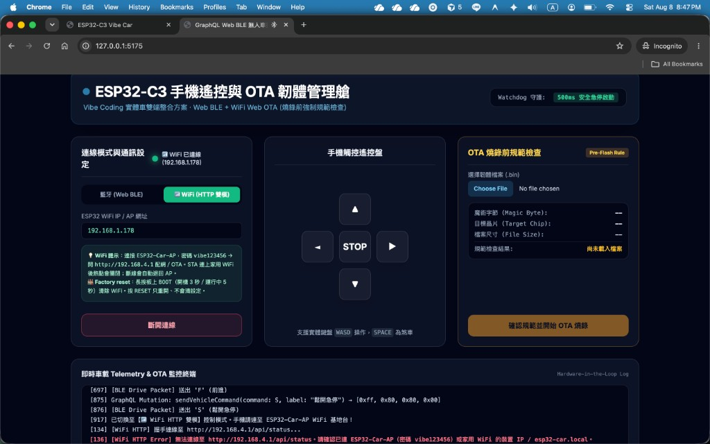
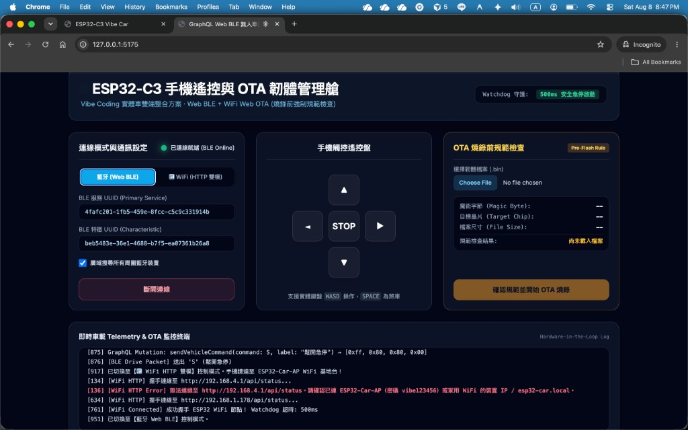
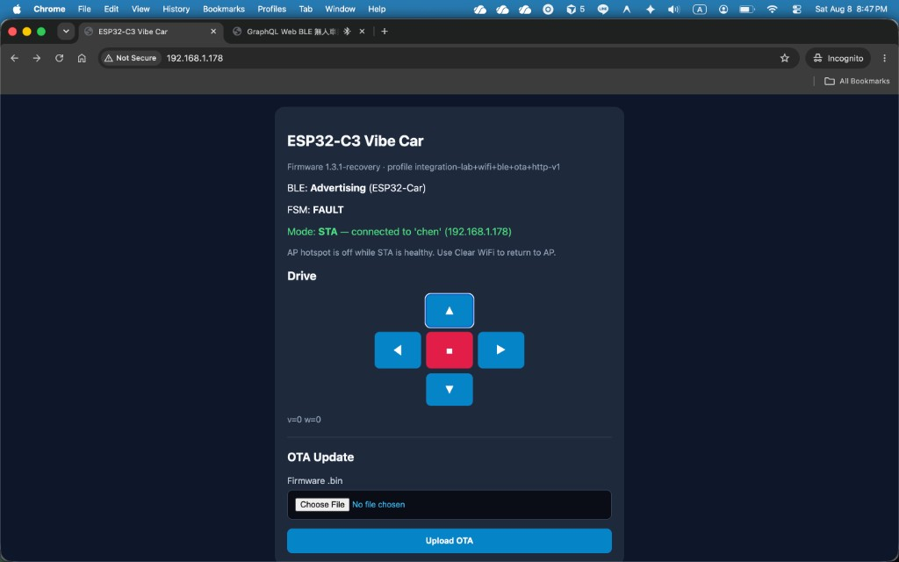

# ESP32-C3 Vibe Car — Firmware Playbook（給人類與 AI Agent）

> **對象**：後續接手的 Cursor / Antigravity / 其他 AI，以及實機操作者。  
> **目的**：避免重蹈「OTA / SoftAP / USB 救援」踩坑，導致板子離線又只能 USB 救。  
> **現行驗證過的版本**：`1.3.1-recovery`（2026-08-08）  
> 前一穩定現場版：`1.3.0-curriculum` / `1.2.3-wpa`（可經 OTA 升級到本版）

---

## 0. 絕對規則（MUST / MUST NOT）

| # | 規則 |
|---|------|
| 1 | **USB `erase-flash` 之後必須寫入 4 個映像**，缺一不可：`bootloader` + `partition-table` + **`boot_app0 @ 0xe000`** + `firmware @ 0x10000`。漏 `boot_app0` → App 不會啟動（無 Serial／無 AP／無 BLE），但燒錄仍顯示 SUCCESS。 |
| 2 | **不要承諾「保證最後一次 USB」**。只有板子已有穩定 HTTP（AP 或 STA）時，後續才能只靠 OTA。離線（無 AP／無 STA／無 BLE）時，無線救不回來。 |
| 3 | SoftAP **必須 WPA2 密碼（≥8 字元）**。iPhone 對「開放熱點」常出現「看得到但無法加入」。現行：`ESP32-Car-AP` / `vibe123456`。 |
| 4 | **OTA 成功後勿在 `setup()` 開頭就 `esp_ota_mark_app_valid`**。現行 `1.3.1-recovery`：穩定開機約 **20s** 後才取消 rollback；壞映像早期 crash 可退回上一版。 |
| 5 | `/api/status` 含 `bleStarted` / `uptimeMs` / `otaAppValidated`。BLE 名稱固定 **`ESP32-Car`**；工廠清 WiFi 可用 BOOT、網頁 Clear、或 BLE `[0xAA,0xF1,0xA5,cs]`。 |
| 6 | 車端 `/` 含簡易方向鍵（`/api/drive`）；完整 UI 仍用 Web Controller。 |
| 7 | WiFi 模式是 **AP ↔ STA 切換**（STA 健康時關 AP）。不要改回「永久雙開 AP」當長期方案；STA 失敗／斷線應退回 SoftAP（grace ~8s）。 |
| 8 | **RESET ≠ Factory Reset**。RESET 只重開、保留 NVS。 |
| 9 | 正式 OTA **只許**上傳專案根目錄的 `firmware_esp32c3_vibe_car_slim.bin`（須為完整車用韌體，Magic `0xE9`、Chip ID `0x05`）。禁止把診斷／測試包 bin 當正式 OTA。 |
| 10 | Mac 上 `esp32-car.local` 常失敗；OTA／除錯優先用 **STA IP**，例如 `OTA_HOST=192.168.1.178 npm run ota`。 |
| 11 | 改韌體後：`pio run` → 複製 `firmware.bin` 為 root `firmware_esp32c3_vibe_car_slim.bin` → 若動到 bootloader/分區，同步重建 USB zip（含 `boot_app0`）。 |

---

## 1. 倉庫路徑

| 用途 | 路徑 |
|------|------|
| 韌體源碼 | `firmware/esp32c3-vehicle/src/main.cpp` |
| PlatformIO | `firmware/esp32c3-vehicle/platformio.ini`（`board_build.partitions = min_spiffs.csv`，雙 OTA ~1.875MB） |
| 正式 OTA bin | `firmware_esp32c3_vibe_car_slim.bin`（專案根目錄） |
| USB 一鍵包 | `Vibe-Car-ESP32C3-USB-Flashing-Pack-1.0.0.zip` |
| OTA 腳本 | `scripts/ota_upload.mjs`（`npm run ota`） |
| **多台車 OTA 步驟（給助教／同學）** | **`docs/OTA-FLEET-GUIDE.md`** |
| 課程對照 | `curriculum/Integration-Lab.md` |

**已淘汰（勿再散佈／勿 OTA）**：`*-WiFi-Join-Test-Pack*`、`*-AP-DIAG*`、舊 `*-Slim-OTA-Pack*`（若與現行 slim 不一致）。

---

## 2. 正確 USB 燒錄流程（救援 / 首次）

### 2.1 何時需要 USB

- 看不到 SoftAP、連不上 STA IP、BLE 也無廣播  
- 曾 `erase-flash` 但漏寫 `boot_app0`  
- OTA 寫入損壞且無法再連 HTTP  

### 2.2 步驟

1. 使用 **`Vibe-Car-ESP32C3-USB-Flashing-Pack-1.0.0.zip`**（或依 §5 重建後的同名包）。  
2. Windows：`flash_win.bat`；Mac：`bash flash_mac.sh`。  
3. 日誌必須出現寫入：
   - `0x0` bootloader  
   - `0x8000` partition-table  
   - **`0xe000` boot_app0**  
   - `0x10000` vibe_car_firmware  
4. 成功後按 **RESET**，等 **15 秒**。  
5. 手機加入：
   - SSID：`ESP32-Car-AP`  
   - 密碼：`vibe123456`  
6. 瀏覽器：http://192.168.4.1  
7. 頁面須顯示 **`Firmware 1.3.1-recovery`**（或之後 bump 的版本字串）。

### 2.3 連不上 SoftAP 時

| 現象 | 處理 |
|------|------|
| 完全看不到 SSID | 確認 USB 包含 `boot_app0`；拔電池只留 USB 供電再燒；檢查是否 brownout 重開迴圈 |
| 看得到但「無法加入」（尤其 iPhone） | 必須有 WPA2 密碼；**忘記網路**後用 `vibe123456` 重連；選「仍要使用此網路」 |
| Windows `netsh` 看不到但手機看得到 | 以手機為準（Windows 掃描 SoftAP 常不可靠） |
| 紅燈常亮 | 多為**電源 LED**，不代表韌體心跳 |

### 2.4 Serial（可選）

- ESP32-C3 USB-Serial/JTAG 在 Windows 上 `miniterm` 常 `Access is denied`／埠瞬斷。  
- 不依賴 Serial 做驗收；以 SoftAP + 網頁版本字串為準。  
- 需要時：115200、開埠後按 RESET；或 Arduino Serial Monitor。

---

## 3. 配網（AP → STA）

1. 連 SoftAP → http://192.168.4.1  
2. 填家用 SSID／密碼（例：`chen`）→ Save & Switch to STA  
3. 手機改連家用 WiFi  
4. 開啟 http://esp32-car.local **或** 路由器／頁面上顯示的 STA IP（例：`http://192.168.1.178`）  
5. 頁面應顯示：`Mode: STA — connected to '...'`  
6. STA 健康時 **AP 會關閉**（設計如此）。STA 失敗／斷線約 **8s** 後應退回 SoftAP。

**Mac 注意**：常解析不了 `esp32-car.local`；改用 STA IP。確認 Mac 與車在同一 SSID、關 VPN／Private Relay。

---

## 4. 正確 OTA 流程（全無線）

> **給現場多台車操作的完整步驟（含「選哪個 bin／不用選 OTA-0/1／如何掃 IP」）：**  
> **[`docs/OTA-FLEET-GUIDE.md`](./OTA-FLEET-GUIDE.md)** ← 請其他人員優先讀這份。

### 4.1 前置條件

- 板子 HTTP 可連：SoftAP `192.168.4.1` **或** STA IP  
- 上傳檔 = 根目錄 `firmware_esp32c3_vibe_car_slim.bin`（現行內容應為 `1.3.1-recovery`）  
- **不要**在網頁上選 OTA-0／OTA-1；那是 flash 雙槽，由系統自動切換  
- 上傳前快速自檢（或信任剛 `pio run` 複製出的檔）：

```bash
python3 - <<'PY'
from pathlib import Path
b = Path('firmware_esp32c3_vibe_car_slim.bin').read_bytes()
assert b[0] == 0xE9, 'bad magic'
assert b[12] == 0x05, 'not ESP32-C3 chip id'
assert len(b) < 1572864, 'over 1.5MB soft limit'
print('OK', len(b), 'bytes')
PY
```

### 4.2 方式 A — 網頁

1. 開裝置網頁（AP 或 STA IP）  
2. Choose File → 只選 `firmware_esp32c3_vibe_car_slim.bin` → Upload OTA  
3. 等 ~20s，重新整理；`/api/status` 的 `"fw"` 應更新  

### 4.3 方式 B — CLI（多台請逐台換 IP）

```bash
cd vibe-coding-car-monorepo
OTA_HOST=192.168.1.178 npm run ota
```

腳本會探測：`OTA_HOST` → `esp32-car.local` → `192.168.4.1`。多台時**務必**設 `OTA_HOST`，勿依賴 mDNS。

### 4.4 OTA 韌體側硬性要求（已實作，勿改壞）

- `Update.begin(UPDATE_SIZE_UNKNOWN)`（勿寫死錯誤長度）  
- 首包驗證 Magic `0xE9` + Chip ID `0x05`  
- 成功回應後 `client().flush()` 再 `ESP.restart()`  
- **勿在 `setup()` 開頭**就 `esp_ota_mark_app_valid`；現行約穩定開機 **20s** 後才取消 rollback  

---

## 5. 從源碼建置並更新產物

```bash
cd firmware/esp32c3-vehicle
pio run -e esp32c3

# 正式 OTA bin
cp -f .pio/build/esp32c3/firmware.bin ../../firmware_esp32c3_vibe_car_slim.bin
```

重建 USB zip 時 **必須** 放入：

```text
bins/bootloader.bin          ← .pio/build/esp32c3/bootloader.bin
bins/partition-table.bin     ← .pio/build/esp32c3/partitions.bin
bins/boot_app0.bin           ← ~/.platformio/packages/framework-arduinoespressif32/tools/partitions/boot_app0.bin
bins/vibe_car_firmware.bin   ← .pio/build/esp32c3/firmware.bin
```

`esptool write-flash` 位址：

```text
0x0     bootloader.bin
0x8000  partition-table.bin
0xe000  boot_app0.bin
0x10000 vibe_car_firmware.bin
```

建議先 `erase-flash` 再寫入（救援情境）。

---

## 6. 運行時行為摘要（勿隨意改壞）

| 項目 | 行為 |
|------|------|
| SoftAP | `ESP32-Car-AP` / `vibe123456`；失敗可 fallback OPEN（僅備援） |
| STA | NVS `vibe_wifi`；連上後關 AP；mDNS `esp32-car` |
| 自癒 | STA 斷線 grace（~8s）後回 AP；AP 下定期重試 STA（不應先拆 SoftAP 再試） |
| Factory | BOOT GPIO9：開機按住 3s／運行長按 5s；或網頁 Clear；或 BLE `[0xAA,0xF1,0xA5,cs]` |
| BLE | 名稱 `ESP32-Car`；封包 `[0xFF, v+128, w+128, checksum]`；建議 WiFi 就緒後再延遲啟動 BLE |
| HTTP 頁 | `/` 含 Drive 方向鍵 + 配網／OTA（見 `docs/assets/verify-car-http-drive.png`） |
| 馬達腳位（C3） | PWM/DIR GPIO 4/5/6/7；LED GPIO8；BOOT GPIO9 |
| Watchdog | 500ms 無指令急停 |
| 供電 | C3 WiFi TX 易 brownout；USB 線差／馬達同供電時可能重開迴圈；可降 TX、必要時暫時關 brownout 偵測（現行碼有處理） |

---

## 7. 驗收檢查清單（Definition of Done）

### 7.0 實機驗收截圖（`1.3.1-recovery`，2026-08-08）

參考圖在 `docs/assets/`。現場對照用：同一網段、STA IP、BLE 廣播名稱正確即算通過。

**Web Controller · WiFi HTTP**（`npm run dev` → 選 WiFi，IP=`192.168.1.178`）



**Web Controller · Web BLE**（選藍牙，可掃到並連上 `ESP32-Car`）



**車端 HTTP 頁**（`http://192.168.1.178/`）— 版本字串、BLE Advertising、STA、Drive 方向鍵



注意：
- STA 健康時 SoftAP 關閉，連 `192.168.4.1` 會失敗（log 出現屬正常）；請用家用網路上的 STA IP。
- 車端 FSM 顯示 `FAULT` 多半是 watchdog 急停待命；按住方向鍵送 `/api/drive` 後會進 RUNNING。
- OTA／除錯以 STA IP 為準；Mac 上 `esp32-car.local` 常解析失敗。

### 檢查項目

- [ ] USB 包含 `boot_app0`，燒錄 log 有 `0xe000`  
- [ ] 手機能加入 SoftAP（密碼 `vibe123456`）並開 http://192.168.4.1  
- [ ] 頁面版本字串正確（現行 `1.3.1-recovery`）  
- [ ] 車端 `/` 可見 Drive 方向鍵與 `BLE: Advertising (ESP32-Car)`  
- [ ] `/api/info` 回傳 profile / pins / BLE UUID；`/api/status` 含 `bleStarted`  
- [ ] `/api/v1/status` 與 `/api/status` 皆可用  
- [ ] 配網後 STA IP 可開（Mac 用 IP，不依賴 `.local`）  
- [ ] Web Controller WiFi 模式可握手 STA IP 並遙控  
- [ ] Web Controller／nRF 可連 BLE `ESP32-Car`  
- [ ] OTA 上傳 `firmware_esp32c3_vibe_car_slim.bin` 後仍能 HTTP 連上  
- [ ] 未留下 Join-Test／AP-DIAG 等易混淆 bin 在根目錄供人誤 OTA  

---

## 7.1 統一 Curriculum 映像涵蓋範圍（`1.3.1-recovery`）

**現場所有學生 ESP32-C3 應 OTA 到此映像**（含 `1.3.0-curriculum` 能力 + recovery 強化），以支援 monorepo Integration Lab + 大部分 Car Basic／Starter 實機驗收。

| 已涵蓋（可實機測） | 說明 |
|---|---|
| SoftAP / STA 配網 / captive / mDNS | `ESP32-Car-AP` / `vibe123456`，AP↔STA；STA 斷線 grace ~8s 回 AP |
| BLE 遙控 | 名稱 `ESP32-Car`；`0xFF` v/w 封包 + 簡易 `0xAA` opcode；`0xF1+0xA5` 清 WiFi |
| HTTP 遙控 | `/` Drive 方向鍵、`/api/drive`、`/api/v1/command`、`/api/v1/car/drive` |
| 狀態／資訊 | `/api/status`（含 `bleStarted`/`uptimeMs`/`otaAppValidated`）、`/api/info` |
| OTA | `/update` + magic/chip 檢查；開機約 20s 後才 mark valid（可 rollback） |
| CORS | 含 GET/POST/PUT/DELETE/OPTIONS + `X-Car-Token` header 允許 |
| 馬達 | C3 GPIO 4/5/6/7；**LEDC 20 kHz**；dead-zone offset 60 |
| Watchdog / FSM | 500ms → FAULT；狀態 IDLE/RUNNING/FAULT |
| Factory | BOOT 長按／網頁 Clear／BLE factory opcode 清 NVS |

| 刻意不進艦隊映像（仍用單元獨立 sketch／模擬） | 原因 |
|---|---|
| 經典 ESP32 GPIO 16–19／LED GPIO2 | 硬體衝突；艦隊是 C3 4–7／8 |
| FreeRTOS 雙核 `xTaskCreatePinnedToCore` | C3 單核 |
| `ESPAsyncWebServer` 完整範例 | 體積／雙伺服器複雜；同步 WebServer 已夠 Lab |
| OTA Basic Auth / anti-downgrade API | 教室易鎖死；安全課用獨立 sketch |
| 座位專屬 SSID／BLE 名 | 用固定 `ESP32-Car-AP`／`ESP32-Car` 便於 OTA 與遙控器 |

**學生 OTA 升級步驟（已在現場的板子）：**

1. 確認能開網頁（STA IP 或 SoftAP）。  
2. 上傳根目錄 `firmware_esp32c3_vibe_car_slim.bin`（內容須為 `1.3.1-recovery`）。  
3. 重開後確認頁面／`/api/status` 的 `"fw":"1.3.1-recovery"`。  
4. 若仍是舊「開放熱點」韌體：OTA 後須**忘記網路**，再用密碼 `vibe123456` 加入。  

---

## 8. 歷史踩坑（給 AI：不要重蹈）

1. **漏 `boot_app0`**：erase 後 SUCCESS 但系統不跑 App。  
2. **開放 SoftAP**：Android／掃得到，**iPhone 無法加入**。  
3. **RESET 當 Factory**：NVS 仍在，壞 STA 密碼 + 舊韌體關 AP →「幽靈裝置」。  
4. **Web BLE 送 ASCII `F/B/L/R`**：車端要 `0xFF` 二元封包（web-controller 已修）。  
5. **文件密碼不一致**（`12345678` / `vibe123456` / 免密碼）→ 一律以源碼 `AP_PASS` 與本 Playbook 為準。  
6. **Mac mDNS**：用 STA IP + `OTA_HOST=`。  
7. **診斷包 bin 當正式 OTA**：會蓋掉完整功能。  

---

## 9. Agent 作業模板（建議照抄）

```text
任務若涉及 ESP32-C3 韌體 / OTA / SoftAP / USB：
1. 先讀 docs/FIRMWARE-PLAYBOOK.md
2. 改 main.cpp 後 pio run，更新 firmware_esp32c3_vibe_car_slim.bin
3. 若需 USB 包：四檔 + boot_app0 @ 0xe000，禁止只寫三檔
4. SoftAP 保持 WPA2 vibe123456，除非有實機證明 iOS 可加入新方案
5. 驗收以手機加入 SoftAP + 版本字串 + STA IP HTTP 為準
6. 不要刪除 boot_app0、不要把 UPDATE.begin 改回固定錯誤長度
7. 不要承諾「絕對不再需要 USB」
```

---

*維護：變更 SoftAP 密碼、版本號、分區或燒錄位址時，同步更新本文件與 USB 包 README。*
